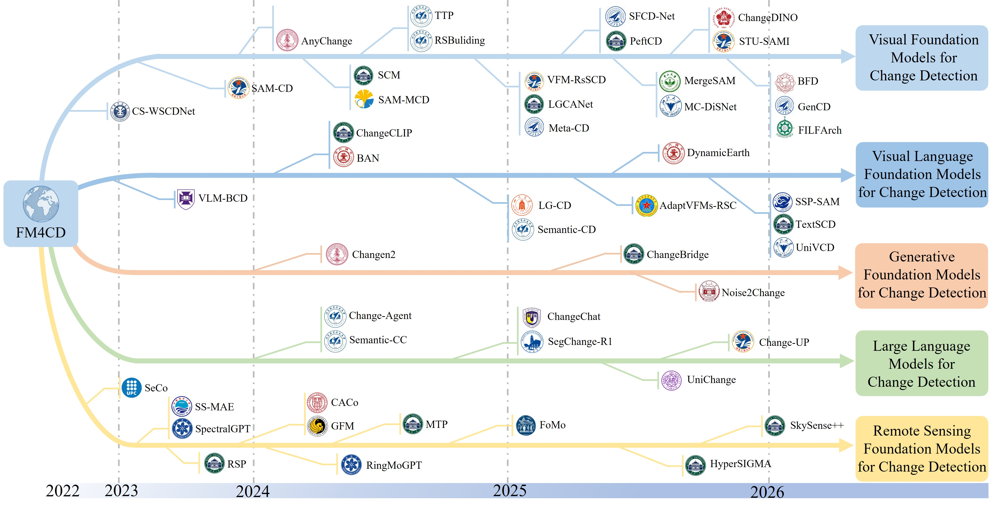

  
  

<h1 align="center">
  Foundation Models for Remote Sensing Change Detection: A Comprehensive Survey
</h1>

  <a href="https://scholar.google.com/"><b>Kaixuan Jiang</b></a> ·
  <a href="https://scholar.google.com/"><b>Chen Wu<b>*</a> 📧·
  <a href="https://scholar.google.com/"><b>Liangpei Zhang<b></a>·
  <a href="https://scholar.google.com/"><b>Bo Du<b></a>·
  <a href="https://scholar.google.com/"><b>Haonan Guo</b></a> ·
  <a href="https://scholar.google.com/"><b>Di Wang<b></a> ·
  <a href="https://scholar.google.com/"><b>Zhenghui Zhao<b></a>·
  <a href="https://scholar.google.com/"><b>Jialu Li<b></a>·
  <a href="https://scholar.google.com/"><b>Xiaolei Qin</b></a> ·
  <a href="https://scholar.google.com/"><b>Yao Jin<b></a> ·
  <a href="https://scholar.google.com/"><b>Wen Zhou<b></a>·
  <a href="https://scholar.google.com/"><b>Chengxi Han<b></a>·
  <a href="https://scholar.google.com/"><b>Hongruixuan Chen</b></a> ·
  <a href="https://scholar.google.com/"><b>Meiqi Hu<b></a> ·
  <a href="https://scholar.google.com/"><b>Zhuo Zheng<b></a>·
  <a href="https://scholar.google.com/"><b>Jia Liu<b></a>·
  <a href="https://scholar.google.com/"><b>Tongfei Liu<b></a> ·
  <a href="https://scholar.google.com/"><b>Lei Ding<b></a>·
  <a href="https://scholar.google.com/"><b>Kaiyu Li<b></a>·
  <a href="https://scholar.google.com/"><b>Xiangyong Cao</b></a>

  
  

This repository records and tracks recent **Foundation Model-based Remote Sensing Change Detection (FM4CD)** methods. If you find any missing work or have suggestions (papers, implementations, or other resources), feel free to open an issue or submit a pull request.

---

⭐ **Star this repo**⭐

If you find this repository helpful, please consider giving it a ⭐.  We will continue updating the latest progress in this field.

 📢 **Add Your Paper to Our Survey**!

- You are welcome to open an issue or PR for your **FM4CD** work!!!
- We will include it in the next update of our survey.
- The repository is under active updating 🥳🔥🔥🔥  

✨ **Highlight**!!
✅ The first comprehensive survey on **Foundation Models for Remote Sensing Change Detection**.

✅ Public datasets, benchmark results, and code links are provided.

✅ We will **continue tracking related work** and keep this repository updated.

 📖 **Introduction**

---

Timeline of FM4CD:

## 📖 Table of Contents

- [Remote Sensing Change Detection with Vision Foundation Models](#remote-sensing-change-detection-with-vision-foundation-models)
- [Remote Sensing Change Detection with Large Language Models](#remote-sensing-change-detection-with-large-language-models)
- [Remote Sensing Change Detection with Vision Language Foundation Models](#remote-sensing-change-detection-with-vision-language-foundation-models)
- [Remote Sensing Change Detection with Generative Foundation Models](#remote-sensing-change-detection-with-generative-foundation-models)
- [Remote Sensing Change Detection with Remote Sensing-specific Foundation Models](#1)
- [hyper](#change-detection)

🧩 **Remote Sensing Change Detection with Vision Foundation Models**

| Time | Model           | Paper Title                                   | VFM Backbone | Code |
| :----: | :---------------: | :-------------------------------------------: | :------------: | :----: |
| 2023 | CS-WSCDNet | [CS-WSCDNet: Class Activation Mapping and Segment Anything Model-Based Framework for Weakly Supervised Change Detection](https://ieeexplore.ieee.org/document/10310006)| SAM  | [✔](https://github.com/WangLukang/CS-WSCDNet?tab=readme-ov-file) |
| 2023 | SAM-CD (Al-Tam) | [SAM-CD: Change Detection in Remote Sensing Using Segment Anything Model](https://www.climatechange.ai/papers/neurips2023/52) | SAM    | ✗    |
| 2024 | SAM-CD(Ding)   | [Adapting Segment Anything Model for Change Detection in VHR Remote Sensing Images](https://ieeexplore.ieee.org/document/10443350/) | FastSAM   | [✔](https://github.com/DingLei14/SAM-CD) |
| 2024 | SAM-MCD   | [CHANGE DETECTION BETWEEN OPTICAL REMOTE SENSING IMAGERY AND MAP DATA VIA SEGMENT ANYTHING MODEL (SAM)](https://arxiv.org/abs/2401.09019) | SAM          | ✗   |
| 2024 | ScanNet | [REMOTE SENSING SEMANTIC CHANGE DETECTION BASED ON THE VISUAL FOUNDATION MODEL](https://ieeexplore.ieee.org/document/10641327/) | MobileSAM    | ✗  |
| 2024 | RSBuilding |[RSBuilding: Toward General Remote Sensing Image Building Extraction and Change Detection With Foundation Model](https://ieeexplore.ieee.org/document/10641327/)     | SAM    | [✔](https://github.com/Meize0729/RSBuilding)    |
| 2024 | SCD-SAM | [SCD-SAM: Adapting Segment Anything Model for Semantic Change Detection in Remote Sensing Imagery](https://ieeexplore.ieee.org/abstract/document/10543161/)| MobileSAM | [✔](https://github.com/yzygit1230/SCD-SAM)    |
| 2024 | SAM-CD(Sun) | [SEGMENT ANYTHING MODEL GUIDED SEMANTIC KNOWLEDGE LEARNING FOR REMOTE SENSING CHANGE DETECTION](https://ieeexplore.ieee.org/abstract/document/10448374/) | SAM | ✗ |
| 2024 |AnyChange| [Segment Any Change](https://proceedings.neurips.cc/paper_files/paper/2024/hash/9415416201aa201902d1743c7e65787b-Abstract-Conference.html)  | SAM | [✔](https://github.com/Z-Zheng/pytorch-change-models)    |
| 2024 | TTP  | [TIME TRAVELLING PIXELS: BITEMPORAL FEATURES INTEGRATION WITH FOUNDATION MODEL FOR REMOTE SENSING IMAGE CHANGE DETECTION](https://ieeexplore.ieee.org/abstract/document/10640593/)        | SAM  | [✔](https://github.com/KyanChen/TTP)    |
| 2024 | PeftCD  | [Unsupervised change detection based on image reconstruction loss with segment anything](https://www.tandfonline.com/doi/full/10.1080/2150704X.2024.2388851)        | SAM| ✗ |
|   2024   |    CHANGE DINO     | [CHANGE DINO: A UNIFIED TRANSFORMER-BASED FRAMEWORK FOR OBJECTLEVEL CHANGE DETECTION AND SEGMENTATION IN REMOTE SENSING IMAGERY](https://ieeexplore.ieee.org/abstract/document/10642342) |      DINO      |                              ✗                               |
|   2025   |     SAM-CEM-CD     | [Adapting SAM via Cross-Entropy Masking for Class Imbalance in Remote Sensing Change Detection](https://arxiv.org/abs/2508.10568) |      SAM       |          [✔](https://github.com/humza909/SAM-ECEM)           |
|   2025   |       ASS-CD       | [ASS-CD: Adapting Segment Anything Model and Swin-Transformer for Change Detection in Remote Sensing Images](https://www.mdpi.com/2072-4292/17/3/369) |    FastSAM     |                              ✗                               |
|   2025   |      BCTDNet       | [BCTDNet: Building Change-Type Detection Networks with the Segment Anything Model in Remote Sensing Images](https://www.mdpi.com/2072-4292/17/15/2742) |      SAM       |                              ✗                               |
|   2025   |      SAM-SAS       | [Change Detection in Synthetic Aperture Sonar Imagery Using the Segment Anything Model](https://www.uaconferences.org/docs/2025_program_papers/2025_05_20_14_12_28_Hedlund_William.pdf) |      SAM       |                              ✗                               |
|   2025   |      DED-SAM       | [DED-SAM:Adapting Segment Anything Model 2 for Dual Encoder–Decoder Change Detection](https://ieeexplore.ieee.org/abstract/document/10741350) |      SAM2      |                              ✗                               |
|   2025   |        DAVI        | [Generalizable Disaster Damage Assessment via Change Detection with Vision Foundation Model](https://ojs.aaai.org/index.php/AAAI/article/view/34994) |      SAM       |                              ✗                               |
|   2025   |      STU-SAMI      | [Integrating Segment Anything Model With Instance-Level Change Generation for Single-Temporal Unsupervised Change Detection](https://ieeexplore.ieee.org/abstract/document/11071869) |      SAM       |         [✔](https://github.com/IceStreams/STU-SAMI)          |
|   2025   | LandslideMetric-CD | [Integration of geospatial foundation models in unsupervised change detection workflows for landslide identification](https://www.tandfonline.com/doi/full/10.1080/17538947.2025.2547292) |      DINO      |                              ✗                               |
|   2025   |      LGCANet       | [LGCANet: Local–Global and Change-Aware Network via Segment Anything Model for Remote Sensing Images Change Detection](https://ieeexplore.ieee.org/abstract/document/11049054) |    FastSAM     |          [✔](https://github.com/Jscript10/LGCANet)           |
|   2025   |      MergeSAM      | [MergeSAM: UNSUPERVISED CHANGE DETECTION OF REMOTE SENSING IMAGES BASED ON THE SEGMENT ANYTHING MODEL](https://ieeexplore.ieee.org/abstract/document/11243146) |      SAM       |                              ✗                               |
|   2025   |         -          | [Multi-Type Change Detection and Distinction of Cultivated Land Parcels in High-Resolution Remote Sensing Images Based on Segment Anything Model](https://www.mdpi.com/2072-4292/17/5/787) |      SAM       |                              ✗                               |
|   2025   |     VFM-ReSCD      | [Recurrent Semantic Change Detection in VHR Remote Sensing Images Using Visual Foundation Models](https://ieeexplore.ieee.org/abstract/document/10929728) |  SAM/FastSAM   |                              ✗                               |
|   2025   |      FAEWNet       | [SAM-Based Building Change Detection with Distribution-Aware Fourier Adaptation and Edge-Constrained Warping](https://ieeexplore.ieee.org/abstract/document/11227013) |      SAM       |        [✔](https://github.com/SUPERMAN123000/FAEWNet)        |
|   2025   |    Siamese-SAM     | [Siamese-SAM: Remote Sensing Image Change Detection with Siamese Structure Segment Anything Model](https://www.mdpi.com/2076-3417/15/7/3475) |      SAM       |                              ✗                               |
|   2025   |        SFMS        | [Spatial–Spectral Feature-Enhanced Mamba and SAM-Guided Hyperspectral Multiclass Change Detection](https://ieeexplore.ieee.org/abstract/document/11045957) |      SAM       |                              ✗                               |
|   2025   |       PeftCD       | [PeftCD: Leveraging Vision Foundation Models with Parameter-Efficient Fine-Tuning for Remote Sensing Change Detection](https://arxiv.org/abs/2509.09572) |  SAM2/ DINOv3  |            [✔](https://github.com/dyzy41/PeftCD)             |
|   2025   |      Meta-CD       | [Combining SAM With Limited Data for Change Detection in Remote Sensing](https://ieeexplore.ieee.org/abstract/document/10902491) |    FastSAM     |         [✔](https://github.com/zhangda1018/Meta-CD)          |
|   2025   |      DA2 -Net      | [DA2 -Net: Integrating SAM2 With Domain Adaption and Difference Aggregation for Remote Sensing Change Detection](https://ieeexplore.ieee.org/abstract/document/11193785) |      SAM2      |         [✔](https://github.com/xuptheqi-hash/DA2Net)         |
| 2025 | DINO-S | [Adapting Vision Transformer for Efficient Change Detection](https://arxiv.org/abs/2312.04869) | DINO/DINOv2 | ✗ |
| 2025 | SAM2-CD | [SAM2-CD: Remote Sensing Image Change Detection With SAM2](https://ieeexplore.ieee.org/abstract/document/11164661) | SAM2 | ✗ |
| 2025 | S2C | [S2C: A Noise-Resistant Difference Learning Framework for Unsupervised Change Detection in VHR Remote Sensing Images](https://arxiv.org/abs/2502.12604) | FastSAM/DINOv2 | [✔](https://github.com/DingLei14/S2C) |
| 2025 | SemSAM-CD | [SemSAM-CD: A Novel Weakly Supervised Change Detection Method Based on Semantic Guidance and Segment Anything Model Refinement](https://ieeexplore.ieee.org/abstract/document/11302783) | SAM | [✔](https://github.com/lium2192/SemSAM-CD) |
|          |                    |                                                              |                |                                                              |
| ........|||||

**Remote Sensing Change Detection with Large Language Models**

| Time | Model           | Paper Title                                   | VFM Backbone | Code |
| :----: | :---------------: | :-------------------------------------------: | :------------: | :----: |
| 2023 | PromptCC | [A Decoupling Paradigm with Prompt Learning for Remote Sensing Image Change Captioning](https://ieeexplore.ieee.org/abstract/document/10271701) | GPT | [✔](https://github.com/Chen-Yang-Liu/PromptCC) |
| 2023 | - | [Large Language Models on Lexical Semantic Change Detection: An Evaluation](https://arxiv.org/abs/2312.06002) | BERT/GPT | [✔](https://github.com/ThisGuyIsNotAJumpingBear/AnotherWindOfChange) |
| 2024 | Semantic-CC | [Semantic-CC: Boosting Remote Sensing Image Change Captioning via Foundational Knowledge and Semantic Guidance](https://ieeexplore.ieee.org/abstract/document/10752619) | Vicuna LLM | ✗ |
| 2024 | Change-Agent | [Change-Agent: Towards Interactive Comprehensive Remote Sensing Change Interpretation and Analysis](https://ieeexplore.ieee.org/abstract/document/10591792) | Change-Agent | [✔](https://github.com/Chen-Yang-Liu/Change-Agent) |
| 2025 | SegChange-R1 | [SegChange-R1: LLM-Augmented Remote Sensing Change Detection]() | Microsoft/Phi-1.5 | [✔](https://github.com/Yu-Zhouz/SegChange-R1) |
|  |  |                                                              |                   |                                                              |

**Remote Sensing Change Detection with Vision Language Foundation Models**

| Time | Model           | Paper Title                                   | VFM Backbone | Code |
| :----: | :---------------: | :-------------------------------------------: | :------------: | :----: |
| 2024 | ChangeCLIP(Du) | [Single-temporal Supervised Remote Change Detection for Domain Generalization](https://arxiv.org/abs/2404.11326) | CLIP | ✗ |
| 2024 | BAN | [A New Learning Paradigm for Foundation Model-Based Remote-Sensing Change Detection](https://ieeexplore.ieee.org/abstract/document/10438490) | CLIP | [✔](https://github.com/likyoo/BAN) |
| 2024 |     LSC-CD     | [Language-Guided Semantic Clustering for Remote Sensing Change Detection](https://www.mdpi.com/1424-8220/24/24/7887) |      CLIP      |                              ✗                               |
| 2024 |      SCM       | [SEGMENT CHANGE MODEL (SCM) FOR UNSUPERVISED CHANGE DETECTION IN VHR REMOTE SENSING IMAGES: A CASE STUDY OF BUILDINGS](https://ieeexplore.ieee.org/abstract/document/10642429) |  CLIP+FastSAM  |          [✔](https://github.com/StephenApX/UCD-SCM)          |
| 2025 |      BFD       | [Burden-Free Distillation From Foundation Model for Efficient Remote Sensing Change Detection](https://ieeexplore.ieee.org/abstract/document/11059258) | CLIP | [✔](https://github.com/Younger-hua/Burden-Free-Distillation) |
| 2025 |  DynamicEarth  | [DynamicEarth: How Far are We from Open-Vocabulary Change Detection?](https://arxiv.org/abs/2501.12931) | CLIP,SAM... | [✔](https://likyoo.github.io/DynamicEarth/) |
| 2025 |      FMT       | [FMT: Foundation Model-based Transformer for Remote Sensing Change Detection](https://www.researchsquare.com/article/rs-7112910/v1) | CLIP | ✗ |
| 2025 |     WHUGCD     | [Open-vocabulary generative vision-language models for creating a large-scale remote sensing change detection dataset](https://www.sciencedirect.com/science/article/abs/pii/S0924271625001595) | CLIP | [✔](https://gpcv.whu.edu.cn/data/) |
| 2025 |  Semantic-CD   | [Semantic-CD: Remote Sensing Image Semantic Change Detection towards Open-vocabulary Setting](https://ieeexplore.ieee.org/abstract/document/11243524) | CLIP | ✗ |
| 2025 |    SSP-SAM     | [Spatio-Semantic Prompt guided Adaptive Segment Anything for Remote Sensing Change Detection](https://ieeexplore.ieee.org/abstract/document/10888518) | CLIP | ✗ |
| 2025 |    TextSCD     | [TextSCD: Leveraging Text-based Semantic Guidance for Remote Sensing Image Semantic Change Detection](https://isprs-annals.copernicus.org/articles/X-G-2025/383/2025/isprs-annals-X-G-2025-383-2025.html) | CLIP | ✗ |
| 2025 |       -        | [VLM-Based Building Change Detection with CNN-Transformer](https://elib.dlr.de/222233/) | Grounding DINO | ✗ |
|  |                |                                                              |                |                                                              |

##  Remote Sensing Change Detection with  Generative Foundation Models

| Time | Model           | Paper Title                                   | VFM Backbone | Code |
| :----: | :---------------: | :-------------------------------------------: | :------------: | :----: |
| 2025 | Changen2 | [Changen2: Multi-Temporal Remote Sensing Generative Change Foundation Model](https://ieeexplore.ieee.org/abstract/document/10713915) | Changen2 | [✔](https://github.com/Z-Zheng/pytorch-change-models) |
| 2026 | Noise2Change | [Generating Any Changes in the Noise Domain](https://ieeexplore.ieee.org/abstract/document/11298555) | Diffusion | [✔](https://github.com/chiangliu/noise2change) |
| 2026 | ChangeBridge | [ChangeBridge: Spatiotemporal Image Generation with Multimodal Controls for Remote Sensing](https://arxiv.org/abs/2507.04678) | DiT-XL | [✔](https://github.com/Z-Zheng/pytorch-change-models) |

## Remote Sensing Change Detection with Remote Sensing–specific Foundation Models 

## change detection

| Time | Model           | Paper Title                                   | VFM Backbone | Code |
| :----: | :---------------: | :-------------------------------------------: | :------------: | :----: |
| 2025 | RFHP-CD | [RFHP-CD: A Prompt-Driven Fine-Tuning Framework of Remote Sensing Foundation Model for Building and Cropland Change Detection](https://ieeexplore.ieee.org/abstract/document/11077146) | HyperSIGMA | ✗ |
|  |  |  |  |  |

